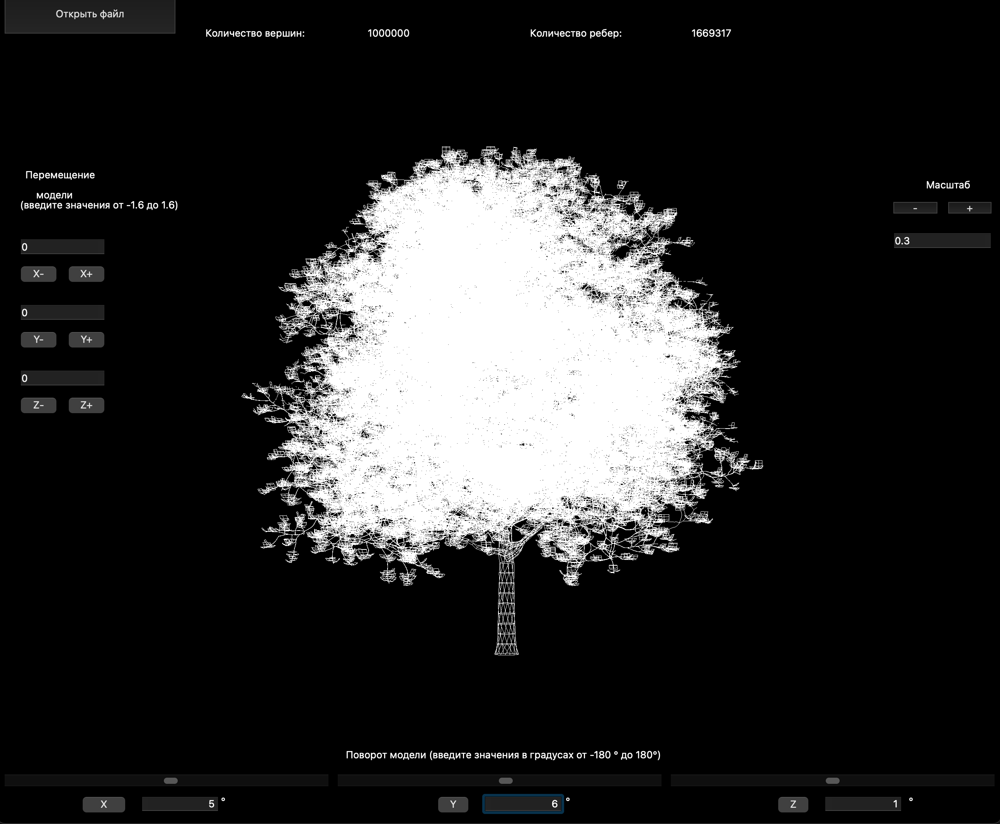

## CPP4_3DViewer_v2.0
Учебный проект в Школе 21 - реализация на языке программирования С++ в парадигме ООП приложения для просмотра 3D моделей в каркасном виде, с применением паттернов проектирования.
  
Программа для визуализации каркасной модели в трехмерном пространстве разработана на языке C++ стандарта C++17.
Сборка программы настроена с помощью Makefile со стандартным набором целей для GNU-программ: all, install, uninstall, clean, dvi, dist, tests.
Обеспечено полное покрытие unit-тестами модулей, связанных с загрузкой моделей и аффинными преобразованиями.

Программа разработана в соответствии с принципами объектно-ориентированного программирования, с использованием паттерна MVC, а также паттернов проектирования фасад, стратегия и одиночка (singleton).

Программа предоставляет возможность:

- Загружать каркасную модель из файла формата obj (поддержка только списка вершин и поверхностей).
- Перемещать модель на заданное расстояние относительно осей X, Y, Z.
- Поворачивать модель на заданный угол относительно своих осей X, Y, Z.
- Масштабировать модель на заданное значение.

Графический пользовательский интерфейс реализован на базе  QT. 

